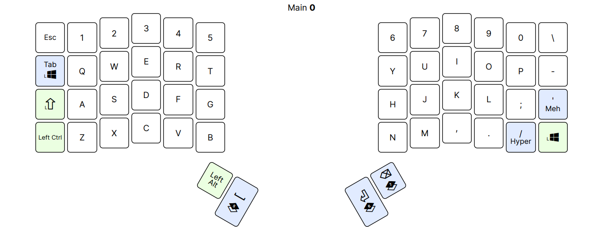

# My Keyboard Layout

This repo contains the custom layout I use to flash my [ZSA Voyager](https://www.zsa.io/voyager) split keyboard.

The Voyager uses the [QMK](https://github.com/qmk/qmk_firmware) firmware.

This is a combination of source built from [Oryx](https://configure.zsa.io) for my [layout](https://configure.zsa.io/voyager/layouts/XgYB9/latest/0) and my additional custom changes (mostly things not supported by Oryx). Whenever possible, my changes are added to the end of the file after a `// ---` marker to avoid conflicts.

I use "layout" and "keymap" interchangeably in this document. Oryx calls them layouts, QMK calls them keymaps.

## Layouts

### Main

Source: [keymaps/main](keymaps/main)

This is my main layout. I designed it for programming and writing in the several languages I interact with to varying degrees (EN/JP/AR/DE), and it also supports gaming.

The base layer is a standard QWERTY English layer. I wanted it to be as close as possible to a standard keyboard if I can help it, which is why this doesn't use home row mods or anything fancy. This works better for me.



A few layers are language layers with mostly minimal but useful changes (Japanese, Arabic, German) which are toggled through a combo (TO), and are exited by holding ESC to go back to base. A few other layers are momentary layers (MO) and are for everything else (symbols, numbers, board, sys, nav, mouse, etc).

## Setup

This section has to be done only once to setup the environment.

I build from Ubuntu in WSL.

First, follow [QMK docs](https://docs.qmk.fm/#/newbs_getting_started) for getting started to install prerequisites and setup qmk cli.

One difference is instead of `qmk setup`, we need to use [ZSA's fork](https://github.com/zsa/qmk_firmware). So first, inside an Ubuntu terminal:

```bash
# Clone the ZSA fork and checkout branch firmware23.
mkdir -p ~/src/github/zsa
git clone https://github.com/zsa/qmk_firmware ~/src/github/zsa
cd ~/src/github/zsa/qmk_firmware
git checkout firmware23
```

Then, setup qmk cli:

```bash
qmk setup -H ~/src/github/zsa/qmk_firmware -b firmware23
```

Ensure it's installed:

```bash
$ qmk hello
Ψ Hello, World!
```

Try to build the default layout to make sure everything's working:

```sh
cd ~/src/github/zsa/qmk_firmware
make voyager:default
# which is equivalent to:
# qmk compile -kb voyager -km default
```

A voyager_default.bin file should be added in the firmware directory.

## Building

This repo contains two important branches, `main` and `oryx`. `oryx` branch contains the source built by Oryx without changes. `main` regularly merges in `oryx` and contains the additional code changes.

First, I build my layout in Oryx and download the source. Then checkout the `oryx` branch in this repo and copy the *_source content into keymaps/main and commit.
Go back to `main`, merge in `oryx` and resolve conflicts if any (should be rare).

Building the custom layout itself to produce a bin to flash is done through a [script](build.bash). The script in summary copies the source from this repo to the firmware repo and builds the bin there, copying it back here to the root of this repo. The script can be run directly if in Ubuntu, or run through the wrapping [powershell script](build.ps1) if in Windows.

## Flashing

After having built the layout into a bin, it's time to flash the firmware on the keyboard.

Although the qmk cli is also capable of directly flashing a bin, I use ZSA's [Keymapp](https://www.zsa.io/flash) app to flash it from the built .bin file.

## Changes

[QMK docs](https://docs.qmk.fm)

I'll try to keep this updated with my changes differing from Oryx layout.

- Custom LED indicator lights depending on the active layers. I have a number of alternative language layers I don't switch to often, but these need to be low so that they can still access MO layers. This setup made the LED indicators useless for the most part. This change implements a custom lighting behavior for these LEDs to be more useful.
- Ensure numlock is turned on on layer switches for numpad to work correctly.
- Apply [Hold On Other Key Press](https://docs.qmk.fm/#/tap_hold?id=hold-on-other-key-press) per key for:
  - Enter/LT
  - Backspace/LT
  - TAB/GUI
- Key overrides:
  - SHIFT+BSPC -> DEL
  - SHIFT+Numpad keys -> Fn keys (avoids the need for an even additional layer just for the fn keys to take the place of number keys)
